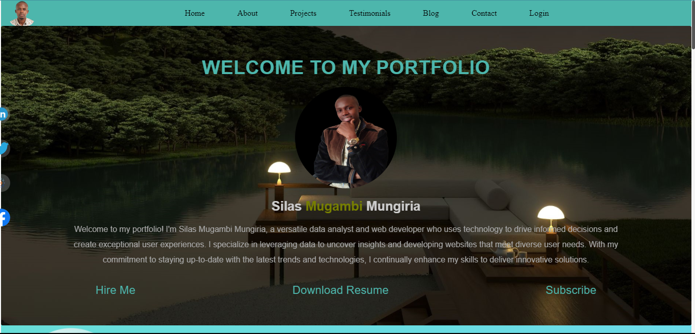
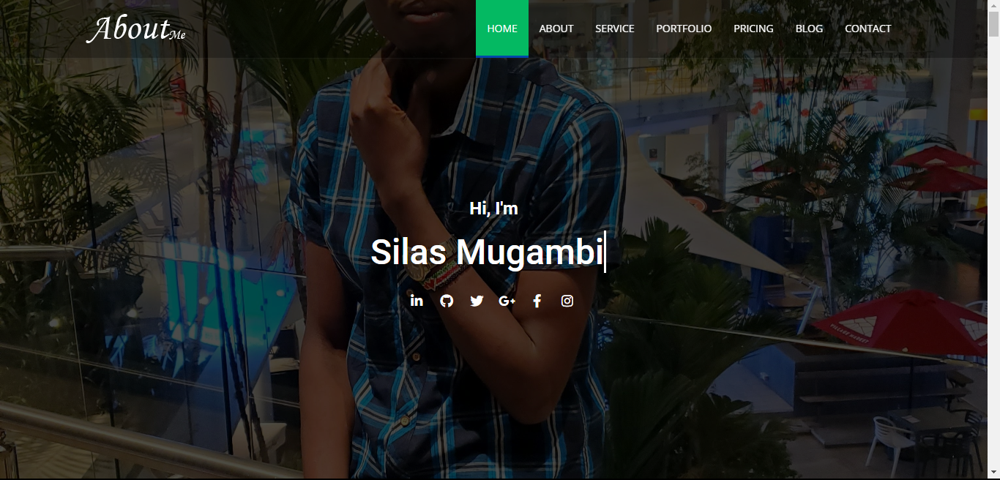

<h2>Portfolio</h2>

<div>
  <h3 align="center">Project Details and Links</h3>

  <p>These projects are freely available for use in building a website. They are responsive for all devices and built using HTML, CSS, and JavaScript.</p>

  <h3 align="center">Portfolios</h3>

  <ol>
    <li><a href="Portfolio-1/index.html"><h4>Simple Portfolio</h4></a></li>
    - This is a simple static website that showcases my work and skills.
    <h4 align="center">Screenshots Demo</h4>
    <div style="display: flex; justify-content: center; align-items: center; flex-wrap: wrap;">
      
    </div>
    <br>
    <a href="Portfolio-1/index.html">View This Portfolio</a>
    <li><a href="Portfolio-2/index.html"><h4>Dynafic Portfolio</h4></a></li>
    - This is a dynamic modern portfolio website with interactive features and a responsive design.
    <div style="display: flex; justify-content: center; align-items: center; flex-wrap: wrap;">
      <h4 align="center">Screenshots Demo</h4>
      
      <br>
      <a href="Portfolio-2/index.html">View This Portfolio</a>
    </div>
  </ol>

  <div align="center">
    <a href="https://mugambi12.github.io/Portfolio"><strong>➥ Live Demo / My Portfolio Projects</strong></a>
  </div>
</div>


<h2 align="center">Prerequisites</h2>

Before you begin, ensure you have met the following requirements:

* [Git](https://git-scm.com/downloads "Download Git") must be installed on your operating system.

<h2 align="center">Run Locally</h2>

To run **these elements** locally, run this command on your git bash:

Linux and macOS:

```bash
sudo git clone https://github.com/Mugambi12/Portfolio.git
```

Windows:

```bash
git clone https://github.com/Mugambi12/Portfolio.git
```

#### License

This project is licensed under the [MIT License](https://choosealicense.com/licenses/mit/).

---
